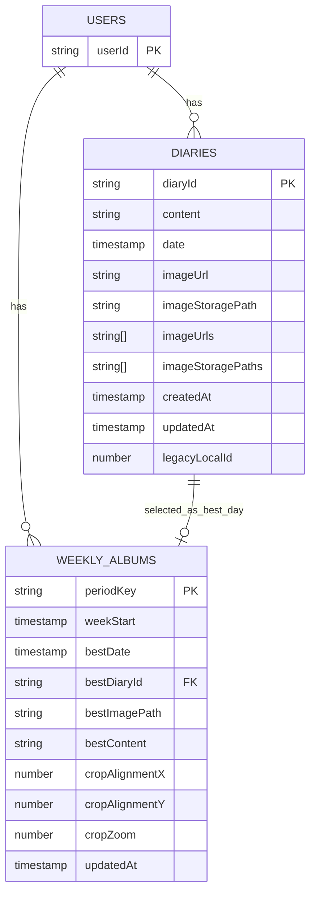
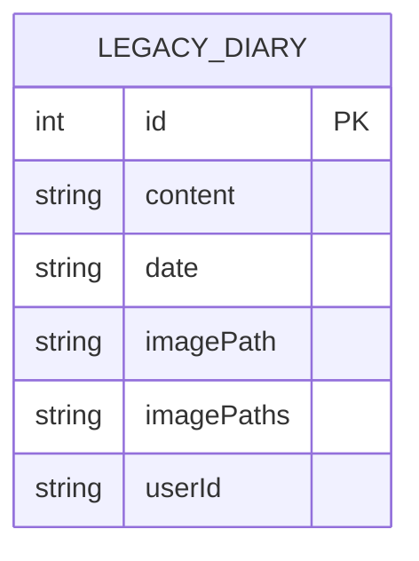

# データベース構造メモ

最終更新: 2026-04-16

このアプリの現在の保存先は、基本的に Firebase です。

- 認証: Firebase Authentication
- 本文とアルバム情報: Cloud Firestore
- 写真ファイル本体: Firebase Storage
- 旧ローカル移行用: SQLite

## 結論

いまのメイン構造は次です。

- `users/{userId}/diaries/{yyyy-MM-dd}`
- `users/{userId}/weeklyAlbums/{periodKey}`
- `users/{userId}/diaries/{yyyy-MM-dd}/...jpg` の形で Storage 保存

ここで `weeklyAlbums.bestDiaryId` が、どの日記をアルバムに選んだかを指しています。

## Firestore の関係図



## Firestore の実際の階層

```text
users
└── {userId}
    ├── diaries
    │   └── {yyyy-MM-dd}
    │       ├── content
    │       ├── date
    │       ├── imageUrl
    │       ├── imageUrls[]
    │       ├── imageStoragePath
    │       ├── imageStoragePaths[]
    │       ├── createdAt
    │       ├── updatedAt
    │       └── legacyLocalId
    └── weeklyAlbums
        └── {periodKey}
            ├── weekStart
            ├── bestDate
            ├── bestDiaryId
            ├── bestImagePath
            ├── bestContent
            ├── cropAlignmentX
            ├── cropAlignmentY
            ├── cropZoom
            └── updatedAt
```

## weeklyAlbums のキー

`weeklyAlbums` の document ID は、今は「月を4分割した期間の開始日」です。

- `YYYY-MM-01`
- `YYYY-MM-08`
- `YYYY-MM-15`
- `YYYY-MM-22`

例:

- `2026-04-01`
- `2026-04-08`
- `2026-04-15`
- `2026-04-22`

つまり 2026年4月なら、

- 1日〜7日
- 8日〜14日
- 15日〜21日
- 22日〜月末

の4区分ごとにアルバム用の代表日記が1件ずつ入ります。

## diaries のキー

`diaries` の document ID は、日付固定です。

- `YYYY-MM-DD`

例:

- `2026-04-16`
- `2026-04-17`

つまり同じユーザーについては、1日につき1 document だけ持つ設計です。

この形にしてあるので、保存時にランダムIDが増えるよりも「1日1日記」を強く保ちやすくなっています。

## Storage の関係

写真ファイル本体は Firestore ではなく Firebase Storage にあります。

保存先パス:

```text
users/{userId}/diaries/{diaryId}/{timestamp}_{slot}.jpg
```

例:

```text
users/abc123/diaries/2026-04-16/1760000000000_1.jpg
```

Firestore 側には、その画像の

- ダウンロード URL
- Storage パス

が保存されます。

## 日記 1件あたりの考え方

日記 1件はこういう構造です。

- 本文: 1件
- 日付: 1件
- 写真: 最大3枚
- カレンダーやアルバムで使う代表写真: 1枚目

つまり「1日1日記、写真は最大3枚」の設計です。

## アルバムとのつながり

`weeklyAlbums` は日記本文を完全に正規化して参照しているわけではなく、

- `bestDiaryId`
- `bestImagePath`
- `bestContent`
- `cropAlignmentX`
- `cropAlignmentY`
- `cropZoom`

を持っています。

なので意味合いとしては、

- `bestDiaryId`: 元の日記への参照
- `bestImagePath`, `bestContent`: 表示用のスナップショット
- `cropAlignmentX`, `cropAlignmentY`, `cropZoom`: アルバム用の切り取り位置

です。

これは、アルバムプレビューを作る時に必要な情報をすぐ出しやすくするためです。
元の日記写真はそのまま残して、アルバムに使う見せ方だけを別で持つ形です。

## 旧ローカル SQLite 構造

Firebase 移行前のローカルデータは SQLite にもあります。
今は主に移行用です。



テーブル名:

```text
diary
```

補足:

- `imagePaths` は JSON 文字列で最大3枚
- `userId` で Firebase ログイン後の持ち主を区別
- 初回ログイン時に Firestore へ移行される

## ざっくりした関係まとめ

```text
1ユーザー
  ├─ 複数の日記
  │    └─ 各日記に写真最大3枚
  └─ 月4区分ごとのアルバム選択
         └─ どの日記を選んだか bestDiaryId で保持
```

## 該当コード

- [lib/diary_service.dart](../../../lib/diary_service.dart)
- [lib/db_helper.dart](../../../lib/db_helper.dart)
- [Firebase Setup](../setup/firebase-setup.md)
